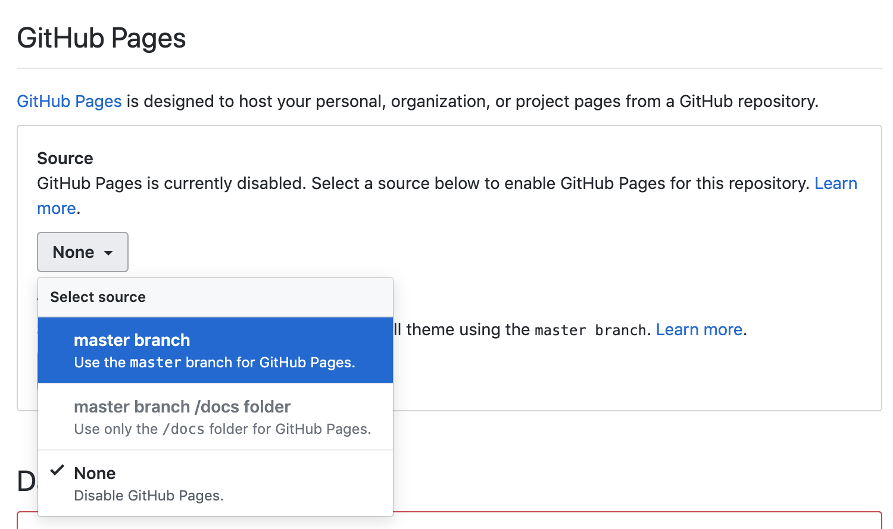

# March’s Jobs Report Indicates Unemployment Rise

### Many fear the implications COVID-19 will have on the economy and jobs. March’s U.S. jobs report was released on the first Friday of the month but many did not expect to see an accurate reflection of what the labor market will look like in a post-pandemic America. The Report just missed the mark before the economy rolled over. However, early data suggests that the highest job losses came from leisure and entertainment, with restaurants and bars taking the hardest hit and affecting employment for those with lower wages. 
 

What else has been done on this topic (provide links)? How is your angle different or fresh?

- [U.S. Employers Cut 701,000 Jobs in March(WSJ)](https://www.wsj.com/articles/u-s-jobs-report-likely-to-show-start-of-record-labor-market-collapse-11585906617?mod=hp_lead_pos3)
- [Record Rise in Unemployment Claims Halts Historic Run of Job Growth (WSJ)](https://www.wsj.com/articles/the-long-run-of-american-job-growth-has-ended-11585215000?mod=itp_wsj&ru=yahoo)
- [A Torrent of Job Losses Threatens to Overwhelm the U.S. Economy (NYT)](https://www.nytimes.com/2020/03/19/business/economy/coronavirus-employers-unemployment.html)

The data was found from the US Bureau of Labor Statistics website, specially the unemployment indicator section that broke down unemployment rates by education level. https://beta.bls.gov/dataQuery/find?fq=survey:%5Bln%5D&s=popularity:D 


Write up at least one or up to three findings from your analysis based on the data you found.

The unemployment for those with a bachlor's degree was surprisingly low, even after the March jobs report was released. For those with higher education levels, the unemployment rate rose to 2.5%, well below the national general avergae rate. Suggesting that even though COVID-19 put the economy in bad shape, so far many higher wage workers were able to retain their jobs. If higher wage workers ratin their jobs, this means after the economy opens back up, retaurants and bars may be able to recover faster than from the 2008 recession when high wage workers lost their jobs, this conclusion is because disposable income remains available.

Who are some potential human sources you could reach out to for more info?:
Got interviews from Dan North, Chief Economist for Euler Hermes and Nick Bunker, Economic Research Director for Indeed.


## How to publish and submit your project

1. Make sure you have navigated to your `data-journalism` folder with your terminal first. Clone a fresh copy of this template and navigate to the folder.

   ```
   git clone git@github.com:JOUR73351/pandas-project.git NAME-OF-YOUR-PROJECT-HERE
   cd NAME-OF-YOUR-PROJECT-HERE
   ```

2) Remove my git tracking from the project

   ```
   rm -rf .git
   ```

3) Create a new repository on GitHub called `NAME-OF-YOUR-PROJECT-HERE` with the following settings.
   <br>
   

4) Run these git commands to initialize the repo. Make sure you've checked `ssh`.

   ```
   git init
   git add -A
   git commit -m "first commit"
   git remote add origin git@github.com:YOUR-USERNAME-HERE/YOUR-REPO-HERE.git
   git push -u origin master
   ```

5) Write your pitch in `README.md`.

6) Write your story in and add your assets and charts to `index.html`. Feel free to play around with and change the styles in `style.css`, but you are not required to. Delete the code that you don't need for your story. The story itself should be no less than 150 words and include at least one chart from Datawrapper. You can embed a Datawrapper chart in your story by copying the embed code into your html as I have done in `index.html.`
   <br>
   

7) You can preview a local version of your story by running a python server.

   ```
   python -m SimpleHTTPServer 8000
   ```

   Then, navigate to `http://localhost:8000` in your browser. Before step 8, you must quit the python server by pressing `ctrl+c`.

8) To save a version of your story on GitHub, run the following git commands.

   ```
   git add -A
   git commit -m "YOUR-COMMIT-MESSAGE-HERE"
   git push
   ```

9) To publish, go to the settings of your GitHub repo, scroll down to GitHub Pages, and configure the source to the master branch.
   
